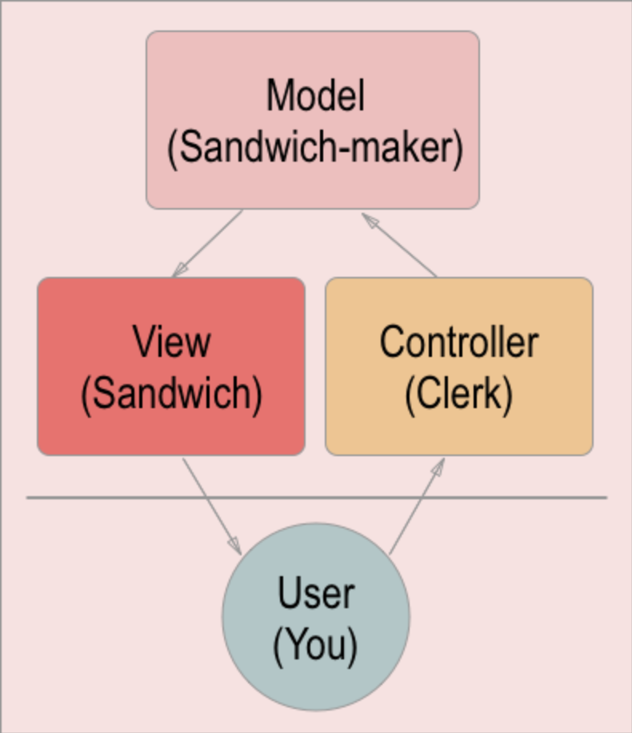
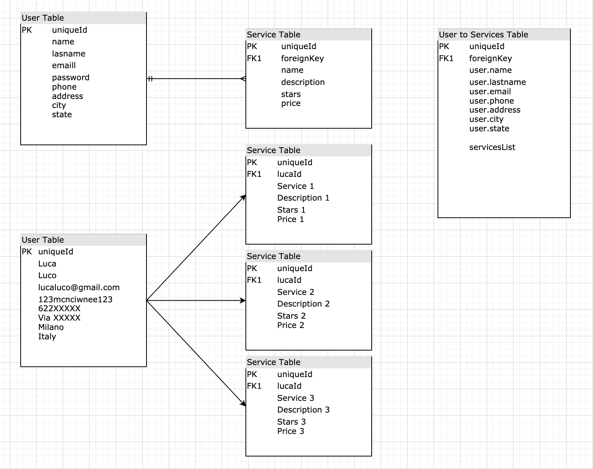

[![Contributors][contributors-shield]][contributors-url]
[![Forks][forks-shield]][forks-url]
[![Stargazers][stars-shield]][stars-url]
[![Issues][issues-shield]][issues-url]
[![MIT License][license-shield]][license-url]

# Technical Design Review - MVP

## 🔮 Overview 🔮
The challenge this tie was to understand about Patters, PHP and MySQL. From the master they challenged our team to create a PHP application using Model View Controller.

  

## 💡 Background 💡

### What is an architecture pattern ?
An architecture pattern is an abstract solution to a certain problem following good practices and reducing the amount of human-hours expend into investigation and development.

### What is the MVC pattern ?
The Model View Controller patter is a way to create applications in an organized and scalable way. Decoupling the **view** (ui) from the **controller** (moderator) from the **model** (data).

### MVC pattern scheme and workflow step by step

### Explain in which cases you would use this pattern
MVC pattern was commonly used to develop GUIs but now it's also very common to use it for web and native applications.

### Advantages of the MVC pattern ?
- **faster development** process because each of the 3 levels it uses are decoupled from each-other.
- Ability to provide **multiple views** for one model. Because the model and the view are not related, adding a new view doesn't affect the entire model.
- Support for **asynchronous techniques** allowing the application to improve the load speed.
- **Data** is returned by the **model** without formatting so it can be used with any interface or view.
- SEO friendly as it is very easy to develop SEO-friendly URLs to generate more visits from a specific application.

The **MVC design pattern** is surely a great approach to building **software applications**. The MVC architecture is easy to implement as it offers above given numerous advantages. Projects that are developed with the help of the MVC pattern can be easily developed with lesser expenditure and within less time too. Above all, its power to manage multiple views makes MVC the best architecture pattern for developing web applications.

  

## ⚓ Goals, non-goals, and future goals ⚓

  

### ✅ Goals ✅
- Implement the MVC pattern using PHP without any library.
- You must have a clear directory structure to be able to implement the pattern.
- Minimum of:
    - **2 Models** with 3 different functions that obtain information from a database from at least 2 tables.
    - **3 View** which at least one of then should be reused by more than one action.
    - **2 Controllers** which one should be the **main controller (index.php)** responsible for receiving the request from the  main page and you must create **one file for each controller** and **one function for each action**. Each action will receive the request as a parameter.
- There must be almost **4 different actions** that demonstrate that the pattern is implemented correctly and are capable of displaying the data obtained from the source in a view.
- **URL’s** must be controlled by **parameters** passed by **GET** method.

  

### ❌ Non Goals ❌

- Have a great design but it will be considered as a good extra point.
- Database doesn't need to have a great design.
- No Object Oriented Programming allowed.

  

### 🤞🏻  Future Goals 🤞🏻

- Work on a great design for the views (UX).
- Implement a v2 of databases architecture in order to have a great and performant MySQL.

  

## ⚙️ Detailed design ⚙️

- Both the code and the comments must be written in English.
- Use the camelCase code style to define variables and functions.
- In the case of using HTML, never use online styles.
- Remember that it is important to divide the tasks into several sub-tasks so that in this way you can associate each particular step of the construction with a specific commit.
- You should try as much as possible, each commit is associated with a task.
- Delete files that are not used or are not necessary to evaluate the project.
- You must create a correctly documented README file in the root directory of the project (see guidelines in Resources).

  

## 🎨 Mockups and wireframes 🎨

  

## ⏳ Work estimates ⏳

This project estimation delivery is for 3 work days. Including all the documentation and learning phase.

  

## 🚀 Roll-out plan 🚀
- **Requirement Analysis** (2h) during the second day we will review with the team all the requirement.
- **Planning** (2h) because MVC allows it we will split development in view, controller and model phases.
- **Architecture Design** (1h) The Architecture was already given. We will need to understand and stick into it. 
- **Software Development** (12h) The app development will be the most complex part.
- **Testing** (1h) for this project we didn't provide any testing tool. Testing on this case will be ensure everything works perfect manually.

  

## 🤖 Tech Stack 🤖

- [PHP](https://www.php.net/docs.php).
- [MySQL](https://dev.mysql.com/doc/).
- [MVC Patter](https://en.wikipedia.org/wiki/Model).

  

## 📚 Resources 📚
* Project requirements from [Assembler](https://docs.google.com/document/d/1g6INDHOTj5wDHr47_osXRirmloEMXURqnQSsq0nOVSQ/edit#heading=h.b804dentmutd)
* Tell me what are [Patterns](https://en.wikipedia.org/wiki/Software_design_pattern) in SE.
* How to understand [MVC](https://www.freecodecamp.org/news/simplified-explanation-to-mvc-5d307796df30/)

<!-- MARKDOWN LINKS & IMAGES -->
<!-- https://www.markdownguide.org/basic-syntax/#reference-style-links -->
[contributors-shield]: https://img.shields.io/github/contributors/VictorGreco/php-mvc-pattern.svg?style=flat-square
[contributors-url]: https://github.com/VictorGreco/php-mvc-pattern/graphs/contributors
[forks-shield]: https://img.shields.io/github/forks/VictorGreco/php-mvc-pattern.svg?style=flat-square
[forks-url]: https://github.com/VictorGreco/php-mvc-pattern/network/members
[stars-shield]: https://img.shields.io/github/stars/VictorGreco/php-mvc-pattern.svg?style=flat-square
[stars-url]: https://github.com/VictorGreco/php-mvc-pattern/stargazers
[issues-shield]: https://img.shields.io/github/issues/VictorGreco/php-mvc-pattern.svg?style=flat-square
[issues-url]: https://github.com/VictorGreco/php-mvc-pattern/issues
[license-shield]: https://img.shields.io/github/license/VictorGreco/php-mvc-pattern.svg?style=flat-square
[license-url]: https://github.com/VictorGreco/php-mvc-pattern/blob/master/LICENSE.txt
[linkedin-shield]: https://img.shields.io/badge/-LinkedIn-black.svg?style=flat-square&logo=linkedin&colorB=555